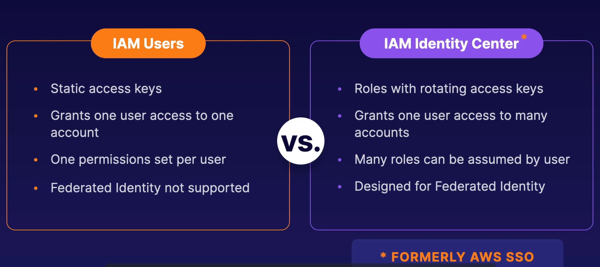

# IAM Identity Center

- Maps users and groups from an identity provider to IAM users and groups.
- Integrated with identity providers that leverage SAML 2.0, like Azure AD.
- AWS SSO can also act as an independent user directory.

**Accessing an Account**

- IAM Identity Center acts as a liason between your identity provider and AWS IAM.
- Allows user to assume roles when accessing an account.

Lets say a user from Group A, logs into their IAM Identity Center. They can choose to assume dev role A and access the dev account, assuming that role.

**How IAM Identity Center Maps Groups to Accounts**

Lets say we have two groups called admins and developers, and we have two accounts called a dev account and a prod account. And we define a couple permission sets and applied them to our groups as needed. When it comes to our dev account, we could give the permission sets admin access and developer access to our admins.

For the prod account, admins would only have admin access since we don’t need any developer access to the prod account. The developers, on the other hand, will only have developer access to the developer account, and they won’t have any access to the prod account.

Not only can you map one user to many accounts, but you can map one user to many permission sets in many accounts.

## Understanding User Access To Your Organization

## AD Connector

Leverages Microsoft Active Directory

In your management account when you use AWS Control Tower to manage your organization, you automatically create what’s called the log archive account. This is a place where logs are stored and no users have access to go in and manipulate the log or delete the log storage.

### [Network Security and Security Groups](../network-controls-and-security-groups/README.md)...
