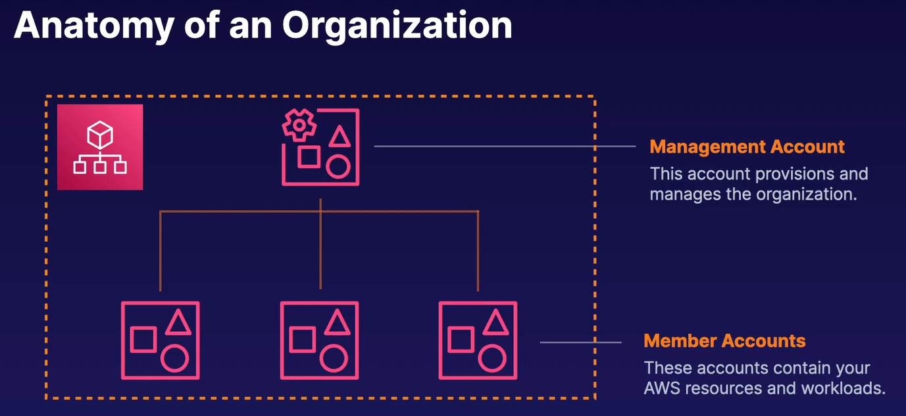
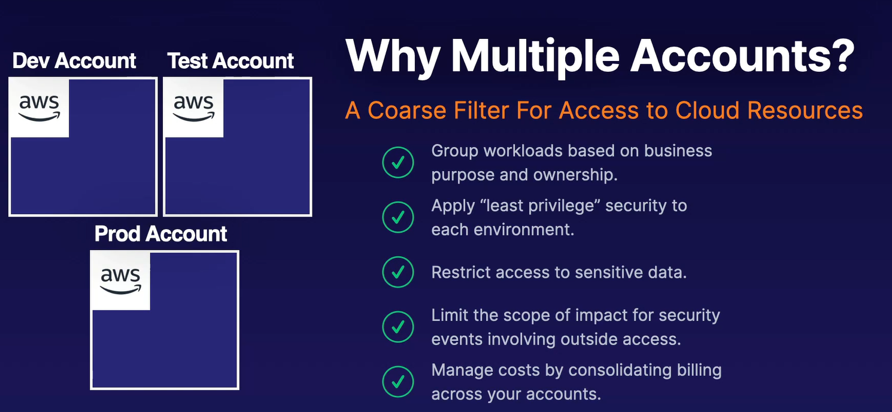

# AWS Organizations

AWS accounts are containers for your cloud resource. An AWS Organization centralized management of multiple accounts.

## Organizational Units (OUs)

Organization units are groups of accounts that share access pattern or serve a similar application or service. You can apply policies to an organization unit. All of the accounts in that OU will have those policies applied to them.

### [Control Tower](../aws-control-tower/README.md)...

