# AWS Secret Manager

- Store passwords, encryption keys, API keys, SSH keys, PGP keys, etc
- Alternative to storing passwords or keys in “vault”
- Can access secrets via API with fine-grained access control provided by IAM
- Automatically rotate RDS database credentials for MySQL, PostgreSQL and Aurora
- Better than hard-coding credentials in scripts or applications.

## Features

- Automatically rotated encryption keys to keep your secrets safe
- Uses KMS keys to encrypt
- Uses Lambda to automatically rotate keys
- IAM roles grant services and applications access to specific secrets.

## Flow

**How it works**

1. One way to grant access to the application is by using a **resource-based policy**. Attaches to the secret itself and it can explicitly allow some entities access to the secret. If your application is given access, it will receive the encrypted secret. The secret will remain encrypted in transit to your application or service that wants to access the plain text of that key, if it’s been given permission by a resource-based policy, can the decrypt that secret.

2. You can also give access to an application through an **identity-based policy.** This is an IAM role you can define granting explicit access to one or more secrets. This role can then be applied to your application and multiple other services. Then those applications or services granted to this IAM role will be able to retrieve and decrypt those secrets.

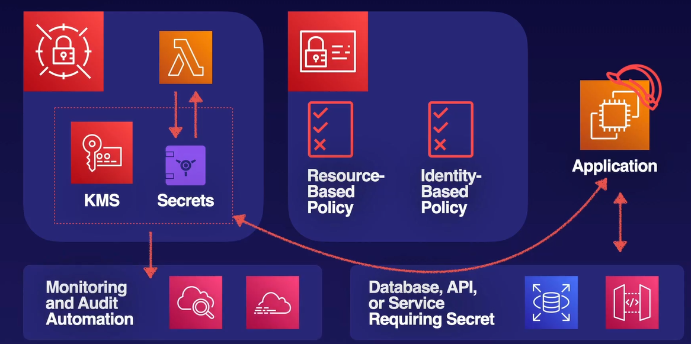

## Use Cases

### Application Access

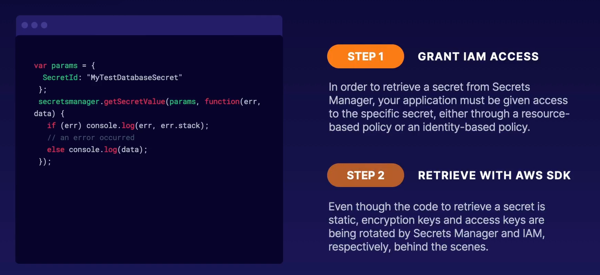

## Things to take away

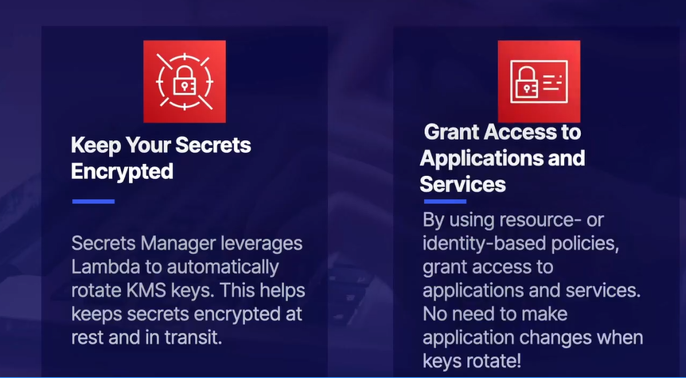

## Sharing Roles Across Accounts

What can assume a Role?

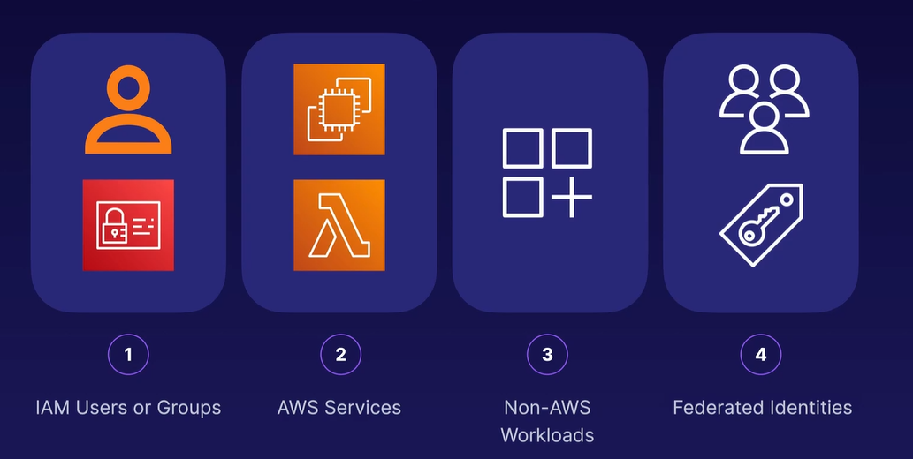

How can you share roles across accounts (1)?

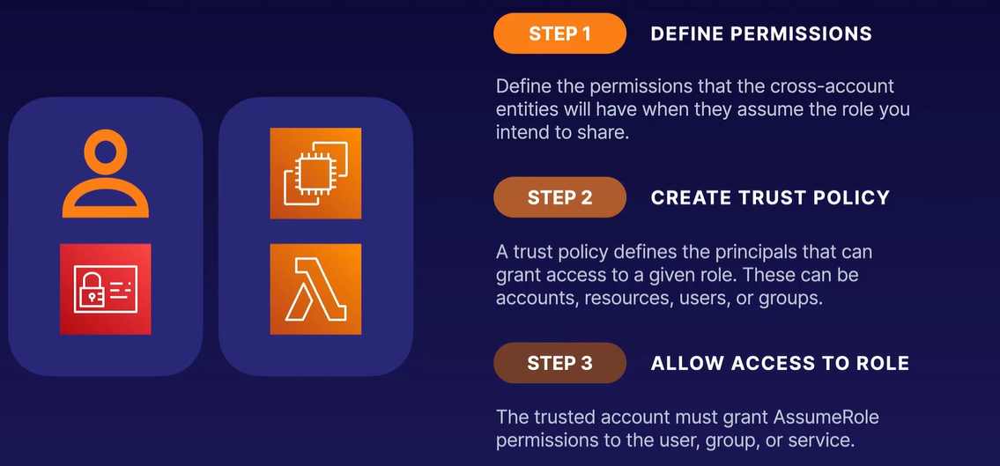

## Trust Policy

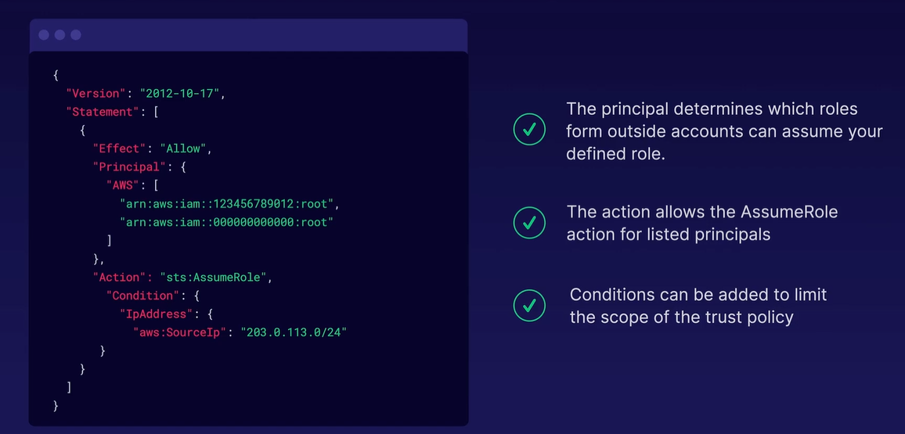

Common use case for Sharing role across accounts

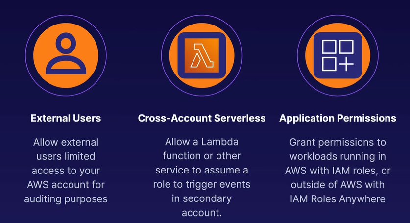

## Things to take away

Permission set, which defines the action you allow when somebody assume the roles.

Trust policy, which defines exactly who can assume that role and from which accounts.

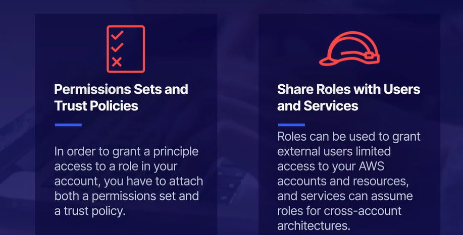

## Sharing Resources Across Accounts

Resource Access Manager it’s a centralized resource sharing service designed to help you share your resources across several AWS account.

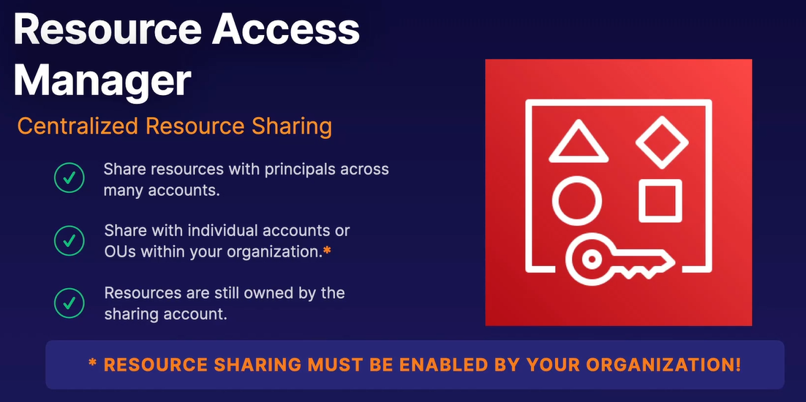

### How it works?

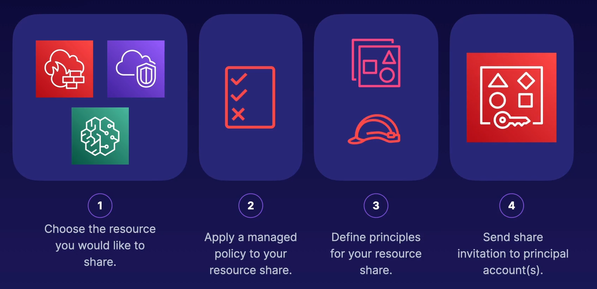

### Common Use Cases

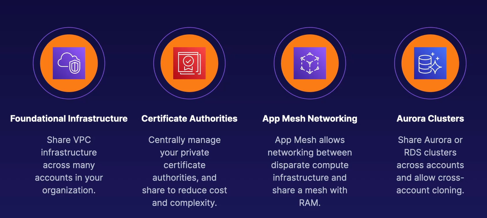

### Example Diagram

We have an account, which has a VPC with two subnets. And we have a second account which would like to share one of those subnets within the same region.

We can use Resource Access Manager to define which subnet we would like to share, add permissions in the form of a managed policy, and then grant that role to the principle of the other account. Once accepted, that VPC and subnet will appear to be in that second account. However, they will have limited permissions and won’t be able to destroy the subnet.

It is important to note that when you share the subnet with another account, it’s going to exist in the same region it is still the same subnet.

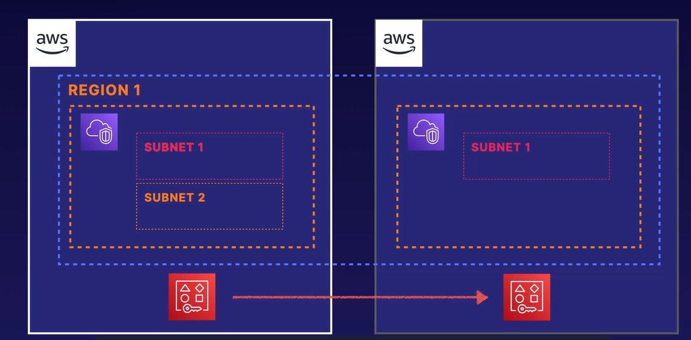

### Things to take away

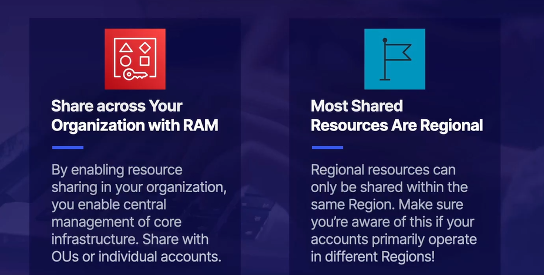

### Up next [Encryption](../encryption/README.md)...
