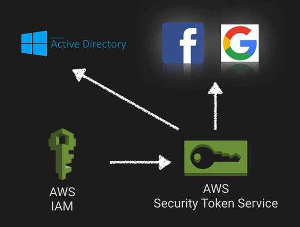
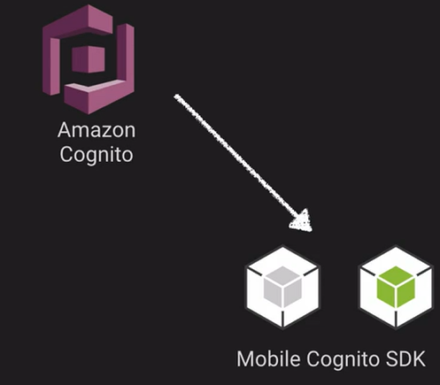
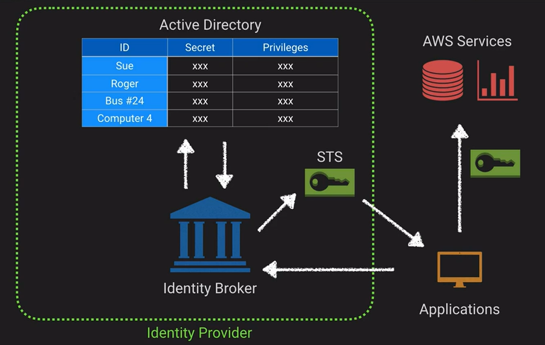
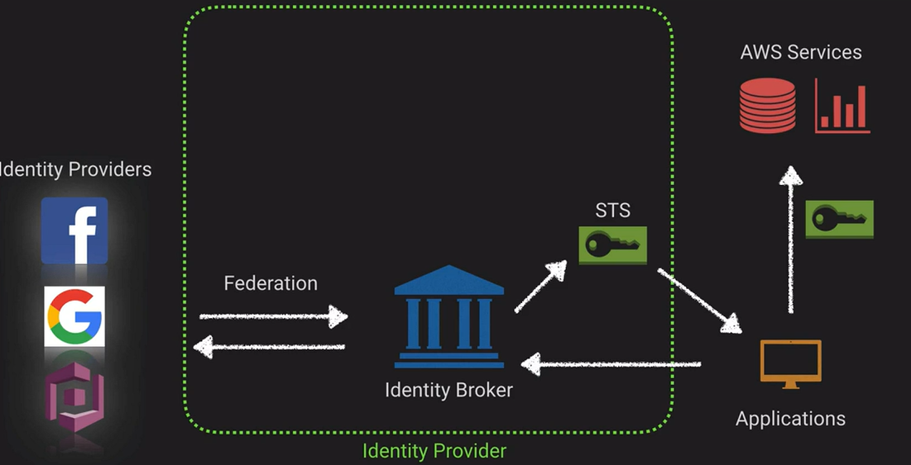

# Credentials and Access Management

You should already know

- [ ]  Know what IAM is and components
- [ ]  Users, Groups, Roles, Policies
- [ ]  Resource-based Policies vs Identity-Based Policies
- [ ]  Know how to read and write policies in JSON
- [ ]  Service → Actions → Resources

**Security Service Token** allows us to temporarily grant credential access to applications or users. And we can source those credentials from IAM, but we can also source from one of the federated options we have.

Amazon Cognito is more designed to be used in mobile applications. And the Cognito SDK already has a lot of this security handling built into it.

## Secure Token Service Flow

Typical Security Flow

1. We have an application and we are going to make a request to the identity broker. 
2. That identity broker is going to turn around and, and it this case, look at our active directory.
3. We are going to authenticate against that, and we are going to fetch the authorizations.  
4. Then we are going to reach out to the Security Token Service and generate  a token to represent that authentication and authorization.
5. We can hand that token over to our application, which then uses it to access a variety of AWS services.

Federation Flow

1. Still generate a token provided that we authenticate properly against one of those federated identity providers.

## Token Vending Machine Concept

A common way to issue temporary credentials for mobile application development. There are two typical modes,

- one is anonymous mode, used as a way to provide access to AWS services and it does not store any user identity.
- Identity TVM can be used for registration and login and keeping up with your user accounts.

AWS recommends that mobile developers use Cognito and the related SDK

### [AWS Secrets Manager](../aws-secrets-manager/README.md)...
