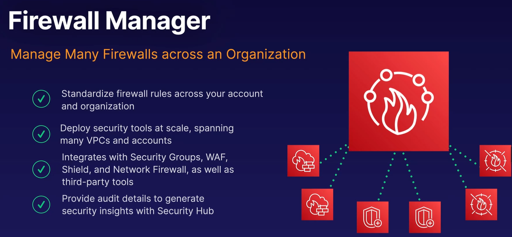
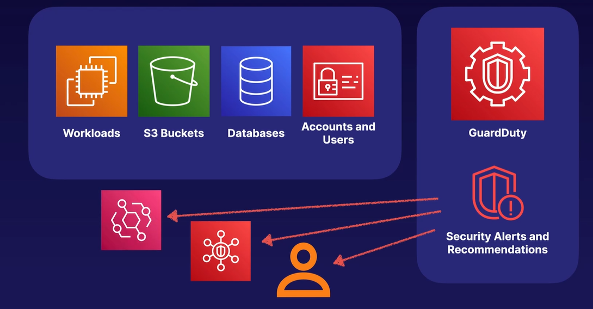
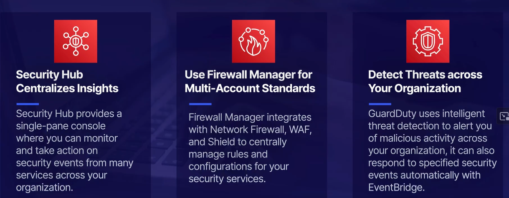

# AWS Firewall Manager

Guardduty for Intelligent Detection

Uses Machine learning to intelligently detect threats and nefarious actions all throughout your AWS ecosystem. It does this by continuously inspecting the API logs that are generated and sent to CloudFront by your various services. It will generate alerts or recommendation. It can alert user, or trigger events in Amazon EventBridge and take automatic remediation actions. Or even Security Hub.

## Things to take away

### [Intrusion Prevention System and Intrusion Detection System](../ips-and-ids-appliances/README.md)...