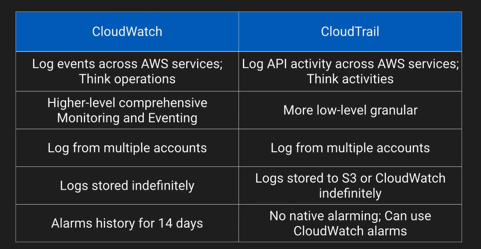

# Intrusion Prevention System and Intrusion Detection System

An example of an architecture that includes an IDS and IPS appliance, it would generally sit in your subnet, and then it would monitor the various parts and pieces of your infrastructure, generally, through an agent that gets installed locally. 

When it identified something that needs to be corrected or handled, it could trigger an alarm. A notification to SMS in the case of the diagram above.

## CloudWatch vs CloudTrail

## Service Catalog

ITIL concepts - https://www.simplilearn.com/itil-key-concepts-and-summary-article

- Framework allowing administrators to create pre-defined products and landscape for their users
- Granular control over which users have access to which offerings
- Make use of adopted IAM roles so users don’t need underlying service access
- Allows end users to be self-sufficient while uploading enterprise standards for developments
- Based on CloudFormation templates
- Administrators can version and remove products. Existing running product version will not be shutdown

Uses something called constraints to see how they are controlled.

## Service Catalog Multi-Account Scenario

In a multi-account environment, you can share a service portfolio with another account. That master account, you can share the catalog, and then the recipient administrator in those other accounts can then import that  portfolio. It can then be kept in sync between the shared portfolio.

One thing that is not inherited is the IAM users and groups and roles. The recipient administrator must add users and groups and roles to the portfolio so those uses in that account can access it.

By default, if we just share a catalog and we import a catalog into the other account, the launch role, and that the IAM role that launches the service on behalf of the user requesting it, is inherited from the shared portfolio.

### Up next [Exam Tips](../security-pro-tips/README.md)...
