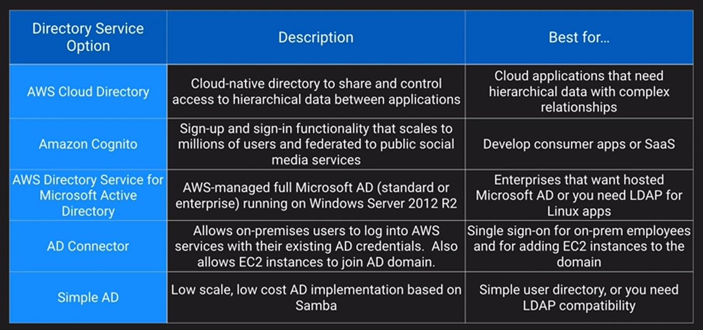
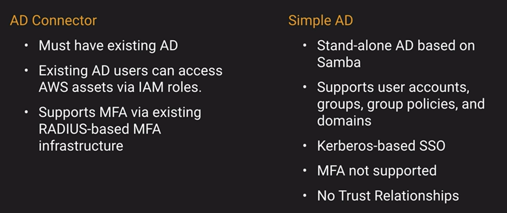

# Network Controls and Security Groups

## Security Groups

- Virtual firewalls for individuals assets ( EC2, RDS, AWS Workspace, etc)
- Control inbound and outbound traffic for TCP, UDP, ICMP or custom protocols
- Port or port ranges
- Inbound rules are by Source IP, Subnet, or other Security Group
- Outbound rules are by Destination IP, Subnets, or other Security Groups

## Network Access Control List - NACLs

- Additional layer of security for VPC that acts as a firewall
- Apply to entire subnets rather than individual assets
- Default NACL allows all inbound and outbound traffic
- NACLs are stateless - meaning outbound traffic simply obeys outbound rules - no connection is maintained
- Can duplicate or further restrict access along with Security Groups
- Remember ephemeral ports for Outbound if you need them

## Why use SG’s and NACL’s ?

- NACLs provide a backup method of security if you accidentally change your SG to be too permissive
- Covers the entire subnet so users to create new instances and fail to assign a proper SG are still protected
- Part of a multi-layer Least Privilege concept to explicitly allow and deny

## AWS Directory Services

### [Credentials and Access Management](../credentials-and-access-mgmt/README.md)...
