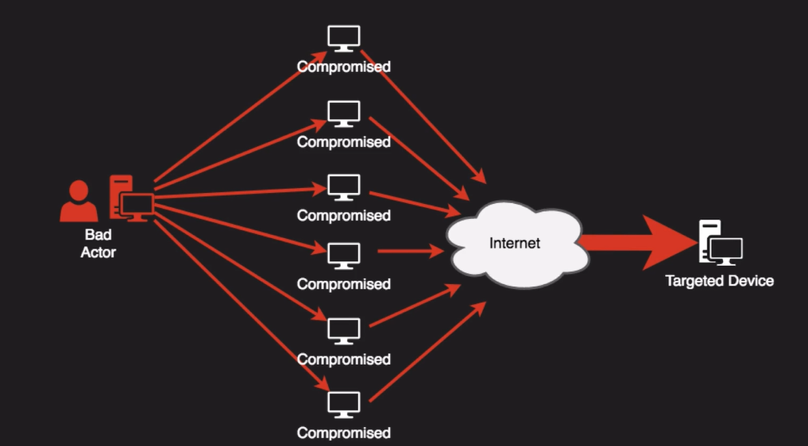
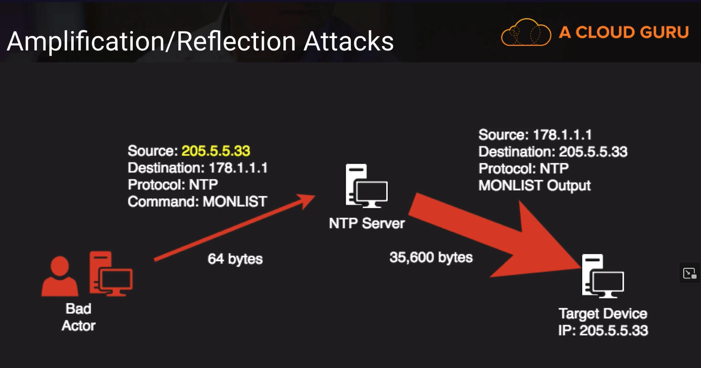
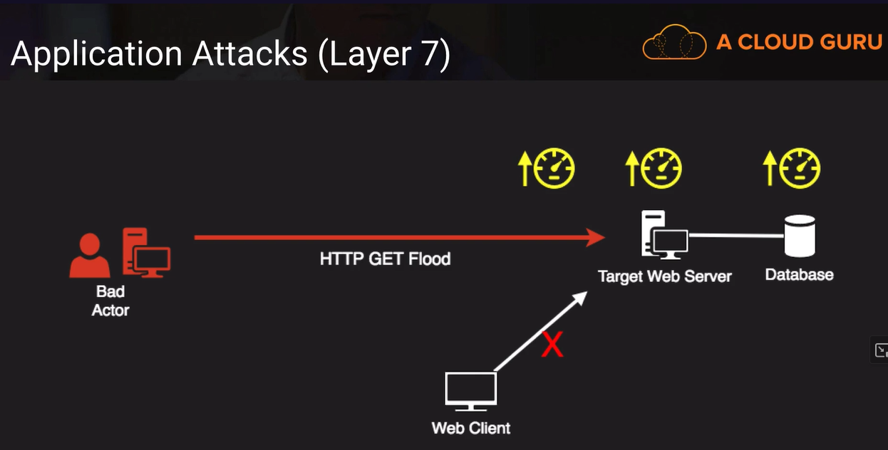
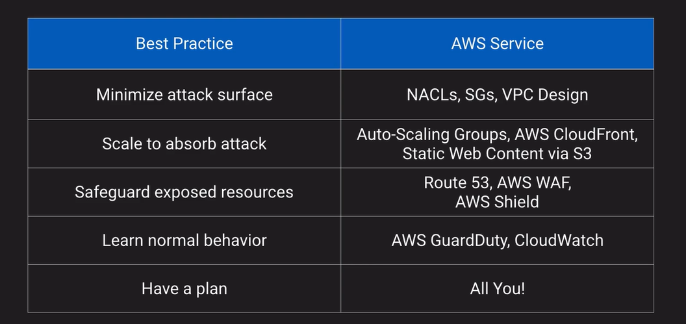
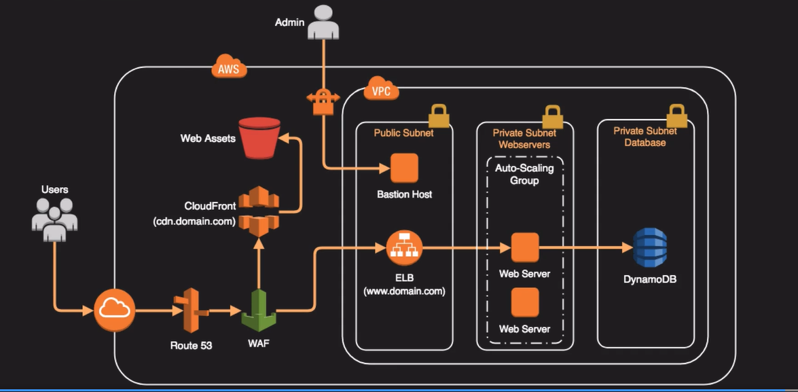

# Distributed Denial of Service Attacks

NTP  = Network Time Protocol Service, has this command built into it called MONLIST.  And it was built in to help with monitoring. It returns the last 600 IP addresses that it’s talk to.

A bad actor can spoof a packet (manipulate a data packet) to make it look like the packet came from some other device. They would send the spoofed packet into an NTP server, and that NTP server would send back a message that many, many times larger to the spoofed address. That has the effect of potentially overwhelming the target.

A bad actor would flood a target web server with GET requests that would push up the utilization of the network coming into the web server. It would push up the utilization of the web server and also maybe if it’s back-ended with a database. It would have the effect of creating an outage or a very slow delay to a web client.

## Mitigate DDoS in AWS

A good example of a Web Site Architecture that is prepared for a DDoS attack

### Up next [Security Hub](../security-hub/README.md)...

