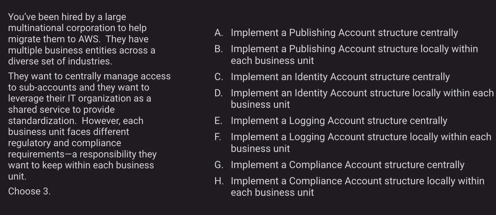
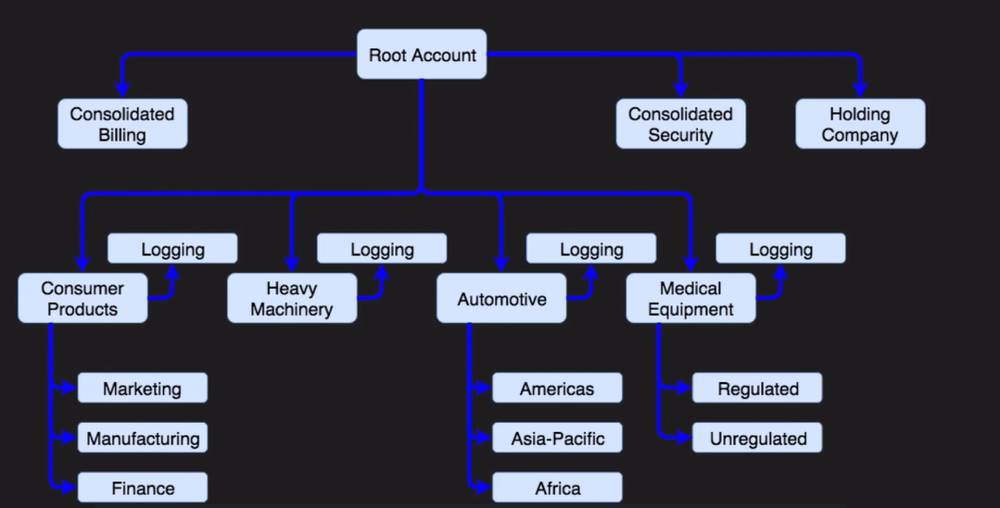
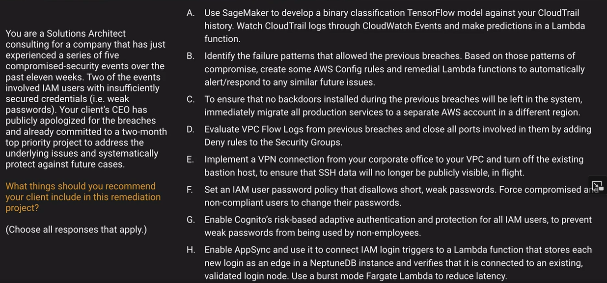

# Security Challenge

## Challenge #1

My answer: H, C, E

One of the things they want to do is leverage their IT organization as a shared service to provide standardization. A Publishing account does that. There is not Compliance Account in AWS.

https://docs.aws.amazon.com/whitepapers/latest/organizing-your-aws-environment/basic-organization.html

**Answers: A, C, and F.**

## Challenge #2

My answer: B / C / D / E / F

A: A slow way to solve this problem

**B: Decent idea, event driven.**

C: This wont do anything at all, eliminated.

D: Close all the ports that I am using, I could close. Security Groups do not have deny rules

E: SSH data is not publicly visible in flight

**F: Should have been done from the first time**

G: IAM and Cognito (user pools) do not overlap.

H: None of this give us any benefit. This is an example of a distracting answer.

**Answer: B and F**