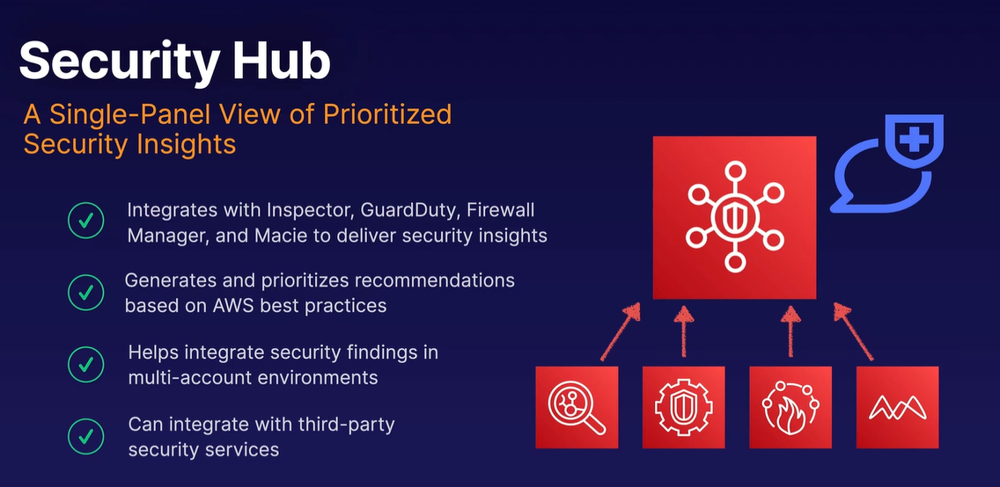
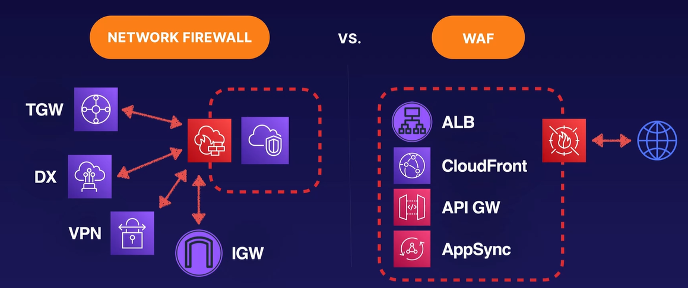
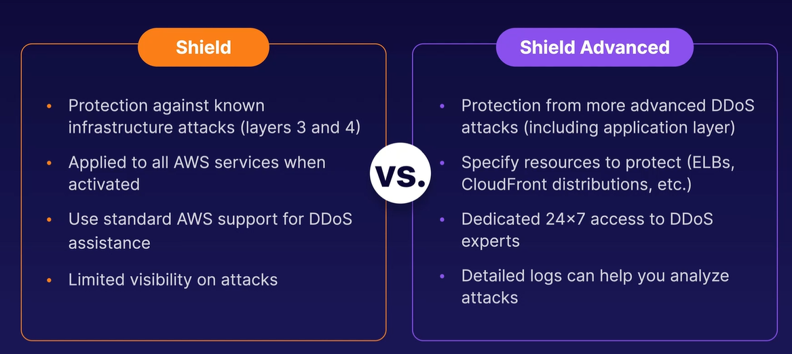

# AWS Security Hub

## Network Firewall vs Web Application Firewall

If you are building highly distributed or serverless applications that are being access from the Internet, Web Application Firewall or WAF, is probably the choice for your application.

## Shield for DDoS

### Up next [AWS Firewall Manager](../firewall-manager/README.md)...